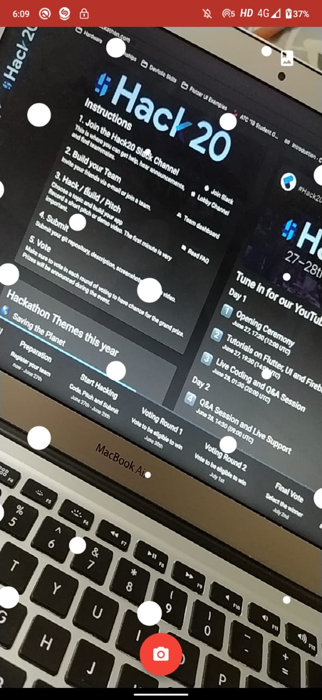
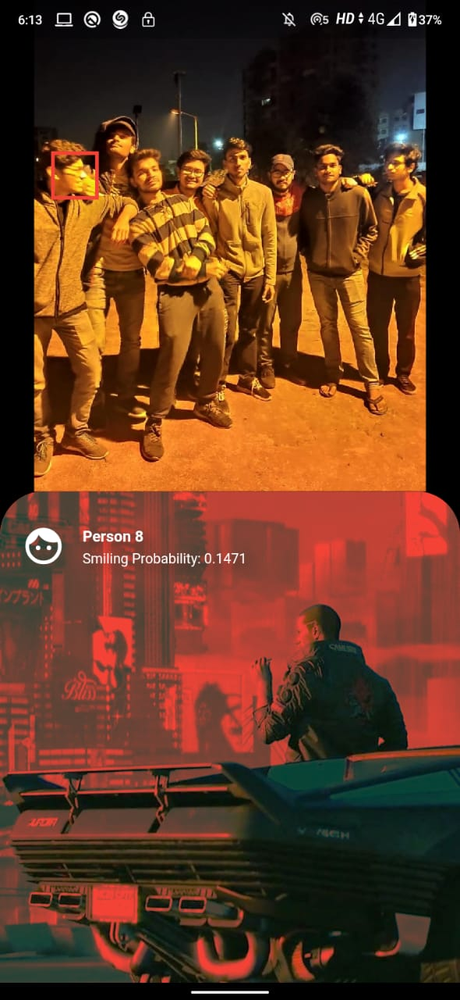

# The Eye
We thought about could be built and we came up with an idea about what if we could click a picture of a crowded face and then see who all are present in the image. We were inspired by Tony Stark's holographic projection phone. We decided to try build an app to detect faces in a given photograph. We used Firebase's ML Kit Face Detection to achieve the same. The rest was simply basics of image transformation like translation and scaling. We also planned to toggle between retro and cyberpunk theme.

## Demo
[Demo Link](https://www.youtube.com/watch?v=LhV2NTLshLg)

## Getting Started
- To get started, a Firebase project needs to be created. Add an android app and download the ```google-services.json``` file in the ```android/app/``` directory.
- Run ```flutter run``` to run the project.

## Screenshots

